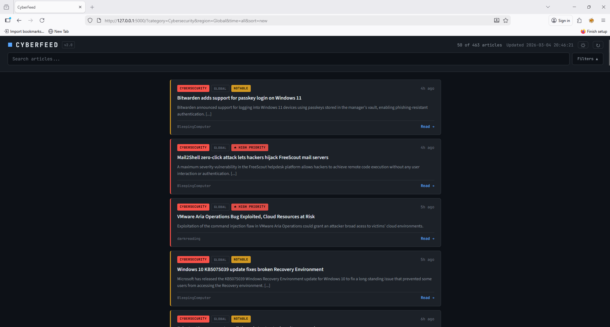

# CyberFeed v2.0

A personal intelligence dashboard that aggregates 37+ RSS feeds across cybersecurity, technology, finance, world news, and Canadian news into a single, filterable, importance-ranked feed with optional AI-powered article summarization.

Built to replace the noise of checking dozens of sources manually with a single interface that surfaces what matters most.




---

## What It Does

CyberFeed pulls articles from 37+ RSS sources in real time, cleans and deduplicates the content, scores each article by importance, and presents everything in a chronological or priority-ranked feed you can filter by topic, region, and time window.

**The problem it solves:** Staying current across cybersecurity, tech, finance, and world news means checking a dozen websites, newsletters, and feeds daily. Most of that time is spent scrolling past irrelevant content to find the few articles that actually matter. CyberFeed consolidates all of it into one place and puts the most important stories at the top.

### Core Features

**Multi-source aggregation** — Pulls from 37+ feeds spanning cybersecurity, technology, finance, crypto, world news, and Canadian news. All sources are fetched in parallel for fast load times.

**Importance scoring and sort modes** — Every article is scored based on source authority (tier-ranked outlets), keyword significance (zero-days, breaches, critical vulnerabilities, major geopolitical events), and recency. Three sort modes let you control how articles are ranked:
- **Hot** — High-importance articles from the last few hours surface first. Best for your morning briefing.
- **New** — Pure chronological order. Most recent articles first regardless of importance.
- **Top** — Highest importance score regardless of time. Best for catching up after time away.

**Filtering** — Filter by topic (Cybersecurity, Technology, Finance, Crypto, World News, Canada), by region (Africa, Asia, Australia, Central/South America, Europe, Global, North America), and by time window (1h, 6h, Today, 24h, 48h, Week, Month). All filters combine and preserve each other's selections.

**Collapsible filter bar** — The filter panel collapses into a single "Filters" button to maximize screen space for reading. Expand it when you need to change a filter, collapse it when you're scanning articles. State persists between sessions.

**Clean content previews** — Raw HTML from RSS feeds is stripped and decoded. Article content is truncated to readable preview length so you can scan quickly and click through only when something matters.

**Deduplication** — Articles that appear in multiple feeds (common with major stories) are automatically deduplicated so you only see each story once.

**Smart caching** — Feeds are cached for 15 minutes to prevent excessive requests. A manual refresh button lets you force a re-fetch when you want the latest content immediately.

**Visual priority indicators** — High-scoring articles are tagged with "HIGH PRIORITY" or "NOTABLE" badges and highlighted with colored borders so they stand out even in chronological view.

**AI summarization (optional)** — Connect a Claude API key and every article gets a 2-sentence AI-generated summary highlighting the key facts. Summaries are cached to disk so you never pay to re-summarize the same article. Uses Claude Haiku for minimal cost (well under $1/month at daily use).

**Dark and light mode** — Toggle between themes with a button in the header. Preference persists between sessions.

**Live search** — Type to filter articles in real time. Press `/` to focus the search bar from anywhere, `Esc` to clear.

**Keyboard shortcuts** — `/` focuses search, `Esc` clears it. Back-to-top button appears on scroll.

---

## How It Works

CyberFeed is a Python Flask application that runs locally on your machine.

1. **Fetching** — On page load (or cache expiry), the app fetches all configured RSS feeds in parallel using Python's `ThreadPoolExecutor`. Each feed is parsed with `feedparser`, and articles are extracted with their title, content, publication date, source, category, and region.

2. **Processing** — Raw HTML in article content is stripped and decoded. Dates are normalized across inconsistent RSS formats into timezone-aware datetime objects. Duplicate articles (identified by title similarity) are removed.

3. **Scoring** — Each article receives an importance score based on three factors:
   - **Source authority** — Feeds are assigned to tiers (1-3). Premier sources like Krebs on Security, BleepingComputer, BBC News, and Dark Reading score higher than smaller outlets.
   - **Keyword detection** — Article titles and content are scanned for high-signal terms. Critical cybersecurity terms (zero-day, actively exploited, ransomware attack, remote code execution) carry the highest weight. Title matches score double since headlines containing these terms are more likely to be directly about the event.
   - **Recency boost** — Articles published within the last hour get a score bonus that decays over 12 hours, allowing the "Hot" sort to favor breaking news.

4. **Rendering** — Articles are passed to a Jinja2 HTML template with all filter parameters. The frontend uses a dark terminal aesthetic with card-based layout, collapsible sticky header, and client-side live search.

5. **AI summarization (optional)** — When an Anthropic API key is configured, filtered articles are batched (up to 20 per request) and sent to Claude Haiku for 2-sentence summarization. Summaries are cached in a local JSON file keyed by article hash, so repeat views of the same article never re-trigger the API.

---

## Getting Started

### Prerequisites

- Python 3.10 or higher
- pip (Python package manager)

### Installation

```bash
# Clone the repository
git clone https://github.com/yourusername/cyberfeed-v2.git
cd cyberfeed-v2

# Install dependencies
pip install -r requirements.txt

# Run the application
python app.py
```

Open your browser and navigate to `http://127.0.0.1:5000`.

### Enabling AI Summarization (Optional)

The feed works fully without AI. To enable article summaries:

1. Get a Claude API key from [console.anthropic.com](https://console.anthropic.com/)
2. Set the environment variable before running:

```bash
# Linux / macOS
export ANTHROPIC_API_KEY="sk-ant-your-key-here"

# Windows CMD
set ANTHROPIC_API_KEY=sk-ant-your-key-here

# Windows PowerShell
$env:ANTHROPIC_API_KEY="sk-ant-your-key-here"
```

3. Run `python app.py` — the console will confirm `AI Summarization: ENABLED`

AI summaries appear with a green "AI" badge on each article card. Cost is negligible — Claude Haiku processes 20 articles for roughly $0.001-0.003, and summaries are cached locally so you never re-summarize the same article.

---

## Configuration

All configuration lives in `app.py` and can be adjusted without modifying the core logic.

**Cache duration** — `CACHE_DURATION` controls how long (in seconds) fetched articles are cached before re-fetching. Default is 900 (15 minutes).

**Articles per feed** — `MAX_ARTICLES_PER_FEED` caps how many articles are pulled from each source to prevent any single feed from dominating. Default is 15.

**Adding or removing feeds** — Edit the `feeds` list. Each entry requires a URL, category, and region:

```python
{"url": "https://example.com/rss", "category": "Cybersecurity", "region": "Global"}
```

The UI adapts automatically — new categories and regions appear as filter buttons without any frontend changes.

**Adjusting importance scoring** — Source tiers are defined in `SOURCE_TIERS` (scale of 1-3). Importance keywords are grouped by weight in `IMPORTANCE_KEYWORDS`. Both can be edited to match your priorities.

**AI batch size** — The `max_batch` parameter in `summarize_articles()` controls how many articles are summarized per page load. Default is 20.

---

## Feed Sources

### Cybersecurity (10 feeds)
BleepingComputer, Krebs on Security, The Record, CyberScoop, Infosecurity Magazine, PortSwigger Daily Swig, Security Magazine, The Hacker News, Dark Reading, Schneier on Security

### Technology (4 feeds)
Ars Technica, The Verge, TechCrunch, WIRED

### Finance (5 feeds)
Investing.com, MarketWatch, Financial Times, Yahoo Finance, CNBC

### Crypto (2 feeds)
Cointelegraph, CoinDesk

### World News (13 feeds)
BBC World, Al Jazeera, UN News, Defense News, NYT World, BBC Africa, BBC Asia, BBC Europe, BBC Latin America, BBC Middle East, BBC Australia, South China Morning Post, Japan Today

### Canada (3 feeds)
CBC Top Stories, CBC Technology, Global News

---

## Project Structure

```
cyberfeed-v2/
├── app.py                 # Flask backend: feed fetching, scoring, AI summarization, routing
├── requirements.txt       # Python dependencies (Flask, feedparser, requests)
├── .gitignore             # Excludes cache files, pycache, and environment files
├── summary_cache.json     # Auto-generated AI summary cache (created at runtime, gitignored)
├── images/
│   └── cyberfeed_v2_dashboard.png  # Dashboard screenshot
├── static/
│   └── style.css          # Dark/light theme stylesheet
├── templates/
│   └── index.html         # Jinja2 frontend template with filters, search, and sort controls
└── README.md
```

---

## Technology Stack

| Component | Technology |
|-----------|-----------|
| Backend | Python 3, Flask |
| Feed Parsing | feedparser |
| HTTP Requests | requests |
| Parallel Fetching | concurrent.futures (ThreadPoolExecutor) |
| Frontend | HTML5, CSS3, vanilla JavaScript |
| Fonts | JetBrains Mono, Source Sans 3 (Google Fonts) |
| AI Summarization | Anthropic Claude API (Haiku 4.5) |

No external databases. No JavaScript frameworks. No build tools. The entire application is four files and three pip dependencies.

---

## What I Learned Building This

This project started as a simple RSS scraper and evolved into a full intelligence dashboard through iterative improvement. Key things I learned along the way:

- **RSS date handling is a mess.** Every feed uses a slightly different date format, and some return timezone-aware datetimes while others don't. Mixing them causes Python's sort to crash. The fix was normalizing every date to UTC timezone-aware on ingestion.
- **Parallel fetching makes a real difference.** Sequential fetching of 30+ feeds took 30-45 seconds. Switching to ThreadPoolExecutor with 10 workers brought that down to 3-5 seconds.
- **Source mixing matters more than source grouping.** The first version displayed articles grouped by source, which meant scrolling past entire blocks of one outlet to find anything from another. Sorting everything chronologically and by importance score after collection made the feed dramatically more useful.
- **Content cleaning is essential for RSS.** Raw RSS summary fields contain HTML tags, encoded entities, and inconsistent formatting. Stripping tags and decoding entities before display turned unreadable jumble into clean previews.
- **Importance scoring doesn't need machine learning.** A simple weighted scoring system based on source tiers and keyword detection surfaces the right articles reliably. The scoring can be tuned over time as you learn which signals matter most for your use case.
- **UI details matter for daily-use tools.** Features like collapsible filters, keyboard shortcuts, and persisted preferences (theme, filter state) seem minor individually, but together they're the difference between a tool you use once and a tool you open every morning.

---

## Roadmap

Potential future improvements:

- [ ] Article bookmarking: save articles to a local file or Obsidian vault for later reference
- [ ] Auto-refresh: silent background re-fetch on a configurable interval
- [ ] Read/unread tracking: mark articles as read to avoid re-scanning
- [ ] Custom keyword alerts: notifications when specific terms appear in new articles
- [ ] Mobile-responsive improvements: better touch targets and swipe gestures
- [ ] Export daily digest: generate a markdown summary of the day's top articles

---

## License

MIT License. See [LICENSE](LICENSE) for details.

---

## Author

Built by yours truly.

- Blog: [securi-tee.com](https://securi-tee.com)
